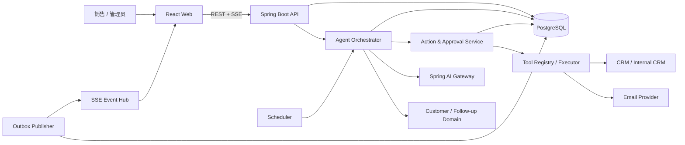
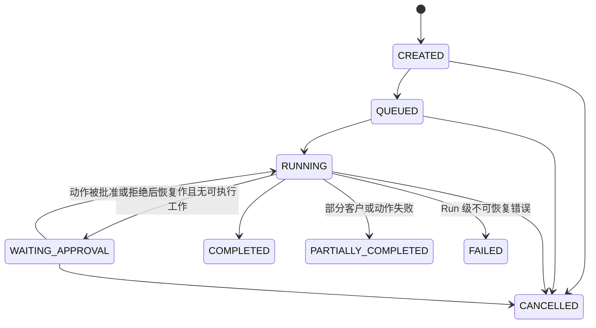
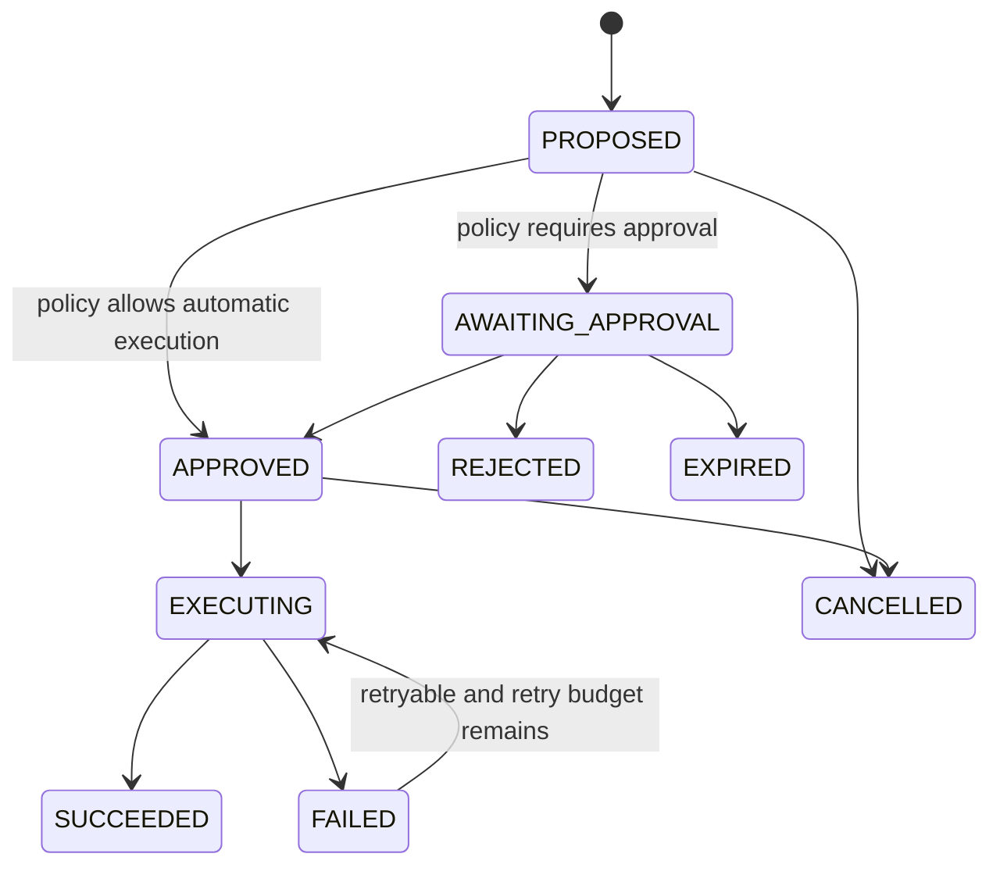
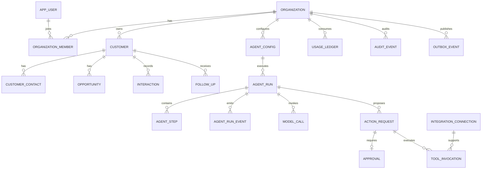

# AI Sales Follow-up Agent 技术设计

> 状态：MVP 基线设计
> 技术栈：React + TypeScript、Spring Boot、Spring AI、PostgreSQL、Redis（可选）、SSE
> 配套数据库迁移：[`V1__initial_schema.sql`](../db/migration/V1__initial_schema.sql)
> 配套前端设计：[`frontend-design.md`](./frontend-design.md)
> 配套认证设计：[`jwt-dual-token-auth.md`](./jwt-dual-token-auth.md)

## 1. 产品边界

### 1.1 第一版目标

面向 3～30 人销售团队，每天自动完成以下闭环：

1. 导入或同步客户、商机和互动记录。
2. 找出应该跟进的客户。
3. 由模型判断销售阶段、购买意向、风险和建议动作。
4. 用确定性规则计算最终优先级。
5. 生成跟进邮件草稿或 CRM 任务。
6. 对有外部副作用的动作发起人工审批。
7. 审批通过后执行，记录外部系统返回值。
8. 展示 Agent 的全过程、成本和业务结果。

一句话原则：**LLM 做模糊判断，应用代码控制流程和副作用。**

### 1.2 MVP 包含

- 多组织、多用户、组织角色。
- CSV/Excel 客户导入；邮箱集成只选 Gmail 或 Outlook 之一实现。
- Customer、Contact、Opportunity、Interaction 统一业务模型。
- Today Queue、客户时间线、Follow-ups、Approvals、Agent Runs。
- 定时和手动触发 Sales Follow-up Agent。
- 模型结构化输出、规则评分、邮件草稿、人工审批、发送、审计。
- SSE 实时进度、用量与模型成本记录。

### 1.3 MVP 不包含

- 通用工作流编辑器、多 Agent 协作、Agent 市场。
- 允许模型自由循环执行任意工具。
- 自动发送邮件的默认能力。
- 向量知识库作为核心依赖。
- 同时集成多个 CRM 和多个邮件服务商。
- 按 Token 对外计费。

## 2. 核心架构决策

| 编号 | 决策 | 理由 |
|---|---|---|
| ADR-001 | 模块化单体起步 | 事务边界清晰，交付快；模块接口可在规模化后拆服务。 |
| ADR-002 | PostgreSQL 是业务事实源 | Chat Memory 只服务模型上下文，不能替代业务历史与审计。 |
| ADR-003 | 编排器控制 Agent | 模型只返回受约束的分析结果或动作建议，不能决定权限和事务。 |
| ADR-004 | 副作用动作先落 `action_request` | 动作可审批、幂等、重试、取消和审计。 |
| ADR-005 | 所有外部写操作默认审批 | 发送邮件、更新 CRM、创建会议等必须经过策略判断。 |
| ADR-006 | AgentStep 与 RunEvent 均为追加式记录 | Step 用于业务追踪，Event 用于 SSE 回放；避免把日志当状态。 |
| ADR-007 | Outbox 保证事务后事件投递 | 不在数据库事务中直接依赖消息系统或 SSE。 |
| ADR-008 | 租户 ID 下沉到业务表 | 便于过滤、分区、审计，并通过复合外键阻止跨租户引用。 |
| ADR-009 | JSONB 存快照，标准列存查询字段 | 保留模型/工具原始上下文，同时让状态和核心指标可索引。 |
| ADR-010 | 先不强依赖 pgvector | MVP 的关键输入是结构化时间线；知识库成熟后再单独迁移。 |

Spring AI 当前支持 `ChatClient` 结构化实体输出、JSON Schema 校验重试、工具调用以及 Micrometer 指标/追踪。对无副作用的只读工具可以使用框架控制的工具循环；对发送邮件等副作用，本设计使用应用控制的执行路径，以加入审批、幂等和审计。参考：[ChatClient](https://docs.spring.io/spring-ai/reference/api/chatclient.html)、[Tool Calling](https://docs.spring.io/spring-ai/reference/api/tools.html)、[Observability](https://docs.spring.io/spring-ai/reference/observability/index.html)。

## 3. 系统上下文



## 4. 后端模块

建议根包：`com.yourcompany.salesagent`。

```text
salesagent
├── identity          Organization、User、Membership、权限
├── customer          Customer、Contact、Opportunity、Interaction
├── followup          Today Queue、评分、Follow-up 生命周期
├── agent
│   ├── api           AgentRun 查询与触发
│   ├── application   SalesAgentOrchestrator、RunCommandHandler
│   ├── domain        AgentRun、AgentStep、状态机
│   └── infrastructure Scheduler、Repository、SSE
├── action            ActionRequest、策略、状态机
├── approval          审批命令与授权检查
├── tool
│   ├── registry      ToolDefinition、ToolRegistry
│   ├── executor      ToolExecutor、幂等、重试
│   ├── email         DraftEmail、SendEmail
│   └── crm           CreateTask、UpdateCustomer
├── ai
│   ├── gateway       SpringAiSalesAnalysisGateway
│   ├── prompt        PromptTemplate、版本
│   ├── schema        结构化输出 DTO
│   └── policy        模型选择、超时、重试、脱敏
├── integration       OAuth 连接、同步游标、Webhook
├── usage             Token、成本、配额
├── audit             业务审计
├── outbox            Transactional Outbox
└── shared            ID、Clock、异常、JSON、事务工具
```

模块依赖方向：

```text
API/Scheduler -> Application -> Domain
Application -> Port interfaces
Infrastructure -> Port implementations
Tool adapters -> external providers
Domain !-> Spring AI / HTTP / MyBatis-Plus
```

不要让 MyBatis 持久化对象直接充当 API DTO 或模型输出 DTO。数据库模型、领域模型和外部协议模型分别演进。常规单表查询使用 MyBatis-Plus Wrapper，复杂联表、JSONB 聚合和报表查询使用显式 Mapper XML，避免把难以审查的 SQL 逻辑散落在 Service 中。

## 5. 领域模型

### 5.1 业务对象

| 聚合 | 职责 | 关键字段 |
|---|---|---|
| Organization | 租户和默认配置边界 | timezone、locale、plan、status |
| Customer | 公司/客户账户 | owner、stage、status、lastInteractionAt、nextFollowUpAt |
| Contact | 客户联系人 | email、phone、title、primary |
| Opportunity | 销售机会 | stage、amount、probability、expectedCloseDate |
| Interaction | 不可变的时间线事件 | type、direction、occurredAt、subject、body、source |
| FollowUp | 某客户当前的一条建议任务 | dueAt、priority、reason、recommendedAction、status |
| AgentRun | 一次完整 Agent 执行 | trigger、status、scope、counters、错误摘要 |
| AgentStep | Run 中的可观察步骤 | sequence、type、status、input/output、耗时 |
| ActionRequest | 拟执行的业务动作 | type、risk、payload、status、idempotencyKey |
| Approval | 对一个 ActionRequest 的审批事实 | decision、requester、decider、comment、时间 |
| ToolInvocation | 一次实际工具调用尝试 | tool、attempt、request/result、externalOperationId |

### 5.2 为什么 Approval 不直接挂 AgentRun

一个 Run 可能为多个客户产生多封邮件，而且每个动作可能被独立批准、拒绝或过期。因此审批必须以 `ActionRequest` 为最小单位：

```text
AgentRun 1 ── N ActionRequest 1 ── 0..1 Approval
                              └── 0..N ToolInvocation
```

### 5.3 Interaction 作为统一时间线

`Interaction` 统一承载：

- `EMAIL_SENT`、`EMAIL_RECEIVED`、`EMAIL_OPENED`
- `CALL`、`MEETING`
- `NOTE`
- `TASK_CREATED`、`TASK_COMPLETED`
- `CRM_UPDATE`

供应商原始数据放 `source_payload JSONB`；模型输入使用经过清洗、截断和脱敏的标准字段。相同外部事件通过 `(organization_id, source, external_id)` 唯一约束去重。

## 6. AgentRun 与 AgentStep

### 6.1 Run 状态机



终态为 `COMPLETED`、`PARTIALLY_COMPLETED`、`FAILED`、`CANCELLED`。

关键约束：

- `AgentRun.status` 是当前快照，不是完整历史。
- 每次状态变化同时追加 `agent_run_event` 和 `outbox_event`。
- 用 `version` 做乐观锁，防止审批回调、Worker 和取消请求互相覆盖。
- `deduplication_key` 阻止同一组织在同一业务日重复创建日常 Run。
- Run 失败不代表所有客户处理失败；单客户错误默认产生失败 Step 并继续。

### 6.2 Step 类型

| 类型 | 示例 |
|---|---|
| SYSTEM | Run 启动、恢复、结束 |
| LOAD_DATA | 加载客户和互动 |
| MODEL_CALL | 客户分析、邮件生成 |
| DECISION | 规则评分、审批策略判断 |
| ACTION_PROPOSED | 创建 ActionRequest |
| APPROVAL_WAIT | 等待人工决策 |
| TOOL_CALL | 发送邮件、创建 CRM Task |
| TOOL_RESULT | 外部执行结果 |
| ERROR | 可恢复或不可恢复异常 |

`agent_step` 保留摘要和 JSON 快照，但模型 Token 和成本单独落 `model_call`，工具尝试单独落 `tool_invocation`，避免一个 Step 承担过多职责。

### 6.3 单次日常 Run 算法

```text
1. 创建 Run（CREATED），用 deduplication_key 去重
2. 入队（QUEUED），事务提交后由 Worker 获取
3. 抢占 lease，切换 RUNNING
4. 查询候选客户：活跃 + 到期/逾期/有新互动
5. 对客户分页处理：
   a. 加载 Customer、Opportunity、最近 N 条 Interaction
   b. 规则预筛；明显无需跟进时跳过模型
   c. 调用 LLM，得到 SalesAnalysisResult
   d. 校验 schema、枚举、长度、分数范围
   e. 计算 deterministic priority
   f. upsert 当前 FollowUp
   g. 如需动作，创建 ActionRequest
   h. 根据 Policy 决定等待审批或直接进入执行队列
6. 汇总计数
7. 若仍有 PENDING Approval -> WAITING_APPROVAL
8. 否则 -> COMPLETED / PARTIALLY_COMPLETED
```

Worker 每处理完一个客户提交一次小事务，避免长事务和大范围锁。

### 6.4 并发和租约

`agent_run` 包含 `lease_owner`、`lease_expires_at`、`heartbeat_at`：

- Worker 使用 `FOR UPDATE SKIP LOCKED` 抢占 `QUEUED` 或租约过期的 `RUNNING` Run。
- 每 20～30 秒续约一次；租约建议 90 秒。
- Worker 崩溃后，另一个 Worker 可在租约过期后恢复。
- 所有可重入阶段必须依赖唯一键或幂等键；不能依赖“这段代码只会运行一次”。

## 7. AI 设计

### 7.1 模型输入

仅提供完成判断所需的数据：

```json
{
  "customer": {
    "name": "ABC Tech",
    "stage": "PROPOSAL",
    "dealValue": { "amount": 120000, "currency": "CNY" },
    "lastInteractionAt": "2026-08-01T10:00:00Z"
  },
  "recentInteractions": [],
  "organizationPolicy": {
    "staleDays": 7,
    "tone": "professional"
  }
}
```

防护措施：

- 用户输入和邮件正文都视为不可信数据，不能覆盖 system instruction。
- 限制互动数量、单条长度和总 Token 预算。
- 默认不向模型发送访问令牌、内部密钥、无关联系人信息。
- Prompt 与输出 schema 都有版本号并写入 `model_call`。

### 7.2 结构化输出

```java
public record SalesAnalysisResult(
    SalesStage stage,
    IntentLevel intent,
    RiskLevel risk,
    boolean followUpRequired,
    int aiScore,
    String reason,
    RecommendedAction recommendedAction,
    List<String> evidence
) {}

public record RecommendedAction(
    ActionType type,
    String objective,
    String suggestedChannel
) {}
```

校验规则：

- `aiScore` 必须为 0～100。
- `reason` 和 evidence 必须能引用输入中的实际互动，不允许凭空声明邮件打开或客户回复。
- ActionType 必须来自服务端枚举。
- 模型输出无效时最多重试 2 次；之后记录失败 Step，不创建动作。
- 即使供应商支持原生 structured output，也必须做应用层 Bean Validation。

当前 Spring AI `ChatClient.entity(..., spec -> spec.validateSchema())` 支持 schema 校验和重试；是否启用 provider-native structured output 由模型能力决定，不能作为跨供应商的唯一保障。

### 7.3 最终优先级

模型只提供 AI 分数，最终分数由可解释规则计算：

```text
priority = clamp(
    aiScore * 0.50
  + overdueScore * 0.20
  + dealValueScore * 0.15
  + recentSignalScore * 0.15
  - suppressionPenalty,
  0, 100)
```

规则版本写入 `follow_up.score_version`，各分项写入 `score_breakdown JSONB`。管理后台以后可以按组织调整权重，但 MVP 使用服务器端版本化配置。

### 7.4 模型降级

- 超时：单次建议 20～30 秒。
- 网络/429/5xx：指数退避，最多 2 次，并尊重供应商 Retry-After。
- 熔断：按 provider/model 维度，不按租户共用敏感上下文。
- 降级模型：只允许 schema 兼容的模型。
- 预算耗尽：停止模型调用，Run 标记 `PARTIALLY_COMPLETED` 并显示明确原因。
- 模型响应不得自动触发同一轮无限 Tool Calling；设置最大模型调用次数和最大动作数。

## 8. Action、Approval 与 Tool

### 8.1 ActionRequest 状态机



`APPROVED` 只代表获得执行许可，不代表已执行。`SUCCEEDED` 只有在外部系统返回成功且结果已持久化后才能写入。

### 8.2 风险策略

| 动作 | 默认风险 | MVP 策略 |
|---|---:|---|
| 查询客户/互动 | LOW | 自动执行，只读 |
| 生成邮件草稿 | LOW | 自动执行，不产生外部副作用 |
| 创建内部 Follow-up | LOW | 自动执行 |
| 创建 CRM Task | MEDIUM | 默认审批，可由管理员策略放开 |
| 更新 CRM 字段 | MEDIUM | 默认审批；限制字段白名单 |
| 发送邮件 | HIGH | 始终人工审批 |
| 安排会议 | HIGH | 始终人工审批 |
| 批量动作 | HIGH | 单独批量审批且限制数量 |

策略服务输入：组织、用户、动作类型、风险、目标资源、批量数、工具来源。策略输出：`ALLOW`、`REQUIRE_APPROVAL`、`DENY`，并把当时的规则快照写进 `action_request.policy_snapshot`。

### 8.3 Approval 语义

- 一个 ActionRequest 最多一个 Approval 记录；审批决定不可覆盖。
- 决策接口必须携带 `expectedVersion`，并以条件更新实现一次性决策。
- 只有组织内具备 `ACTION_APPROVE` 权限的成员可审批。
- 默认禁止请求者自批高风险动作；Owner 是否例外由组织策略决定。
- 审批前再次检查 Action 是否过期、目标客户是否被删除、邮箱连接是否可用。
- 邮件审批页展示最终收件人、主题、正文、附件和模型理由；执行内容必须与批准快照完全一致。
- 修改草稿会生成新 ActionRequest 或递增内容版本并使旧审批失效，不能沿用旧批准。

### 8.4 Tool Registry

工具定义主要由代码注册，不让数据库动态加载任意类：

```java
public interface AgentTool<I, O> {
    ToolDescriptor descriptor();
    O execute(ToolExecutionContext context, I input);
}

public record ToolDescriptor(
    String name,
    String version,
    JsonSchema inputSchema,
    JsonSchema outputSchema,
    ToolRisk risk,
    boolean readOnly,
    Duration timeout,
    RetryPolicy retryPolicy
) {}
```

`ToolRegistry` 在启动时注册工具并拒绝重复 `(name, version)`。数据库 `tool_policy` 只覆盖 enable/disable、审批要求、限流等策略，不能上传可执行代码。

### 8.5 工具执行顺序

```text
1. 读取 ActionRequest 并锁行
2. 校验状态为 APPROVED、未过期、组织一致
3. 解析 ToolDescriptor，验证 payload schema
4. 使用 action_request.idempotency_key 创建 ToolInvocation
5. Action -> EXECUTING，提交事务
6. 调用外部 API（事务之外）
7. 新事务内持久化结果、外部 operation id
8. Action -> SUCCEEDED/FAILED
9. 成功后写 Interaction / CRM 映射
10. 追加 RunEvent、AuditEvent、OutboxEvent
```

不要持有数据库事务等待外部 HTTP 响应。

### 8.6 幂等和重试

- 业务幂等键示例：`send-email:{organizationId}:{actionId}:{contentHash}`。
- `tool_invocation` 对 `(organization_id, idempotency_key, attempt_no)` 唯一。
- 如果供应商支持 idempotency key，向下透传。
- 网络超时且外部结果未知时状态为 `UNKNOWN`，先通过 provider operation id 查询，不盲目重发。
- 认证错误、参数错误、权限错误不可自动重试。
- 429、部分 5xx 可退避重试；最大次数由 ToolDescriptor 固定。
- 邮件发送默认不自动重试“结果未知”的请求，避免重复触达客户。

## 9. 数据库设计

### 9.1 关系概览



### 9.2 表分组

| 分组 | 表 |
|---|---|
| Identity | `organization`, `app_user`, `organization_member` |
| Integration | `integration_connection`, `integration_sync_cursor` |
| Sales | `customer`, `customer_contact`, `opportunity`, `interaction`, `follow_up` |
| Agent | `agent_config`, `agent_run`, `agent_step`, `agent_run_event`, `model_call` |
| Action | `action_request`, `approval`, `tool_policy`, `tool_invocation` |
| Operations | `usage_ledger`, `audit_event`, `outbox_event`, `idempotency_record` |

完整字段、约束和索引见 SQL 迁移。重要设计点：

- 全部时间使用 `timestamptz`，业务日按 `organization.timezone` 计算。
- 金额使用 `numeric(19,4)` + ISO 4217 三位币种。
- 邮箱使用 `citext`；UUID 使用 `gen_random_uuid()`。
- 所有可变表都有 `created_at`、`updated_at` 和必要的 `version`。
- JSONB 只用于供应商原始值、快照和可扩展元数据；状态、外键、排序字段不得只藏在 JSONB。
- 业务表通过 `(organization_id, id)` 唯一键和复合外键避免跨组织关联。
- `interaction`、`agent_step`、`agent_run_event`、`audit_event` 设计为追加式；修正通过新记录完成。

### 9.3 事务边界

| 命令 | 同一事务内必须完成 |
|---|---|
| 创建 Run | Run + 初始 Event + Outbox |
| 完成模型判断 | ModelCall + Step + FollowUp upsert + Run counters + Events |
| 提议动作 | ActionRequest + Approval（若需要）+ Step + Events |
| 审批 | Approval decision + Action 状态 + Audit + Events |
| 工具开始 | ToolInvocation + Action EXECUTING + Events |
| 工具完成 | ToolInvocation result + Action final state + Interaction（成功时）+ Usage + Events |

外部 HTTP 请求永远不包含在上述数据库事务中。

### 9.4 保留策略

- Customer、Opportunity、Approval、Audit：按合同和法规保留，默认不硬删除。
- Interaction 正文：可配置 12～36 个月；元数据可保留更久。
- Prompt/Completion：默认只存脱敏内容或哈希；生产环境不要默认开启完整内容日志。
- RunEvent：在线保留 90 天，归档后可清理。
- Outbox：发布成功后保留 7～30 天。
- IdempotencyRecord：至少保留最长重试窗口，建议 7 天。
- 使用量台账：至少保留账单周期 + 对账窗口。

高数据量后，优先按月分区 `interaction`、`agent_step`、`agent_run_event`、`audit_event`，而不是过早拆微服务。

## 10. API 设计

统一前缀 `/api/v1`。组织上下文来自已验证的访问令牌和服务端 membership，不接受客户端任意声明组织 ID。

### 10.0 Session 与权限

```http
GET /session
GET /organizations/{organizationId}/permissions
```

`/session` 返回当前用户、可访问组织、当前组织和基础会话信息；组织切换后通过权限接口获取该组织的有效权限。服务端必须根据已认证用户验证 membership，不能仅信任路径里的组织 ID。

### 10.1 Dashboard 与客户

```http
GET  /dashboard?date=2026-08-18
GET  /customers?cursor=...&stage=PROPOSAL&ownerId=...
POST /customers/imports
GET  /customers/{customerId}
GET  /customers/{customerId}/timeline?cursor=...
GET  /customers/{customerId}/follow-ups
```

### 10.2 Follow-up

```http
GET   /follow-ups?status=OPEN&due=TODAY
GET   /follow-ups/{followUpId}
POST  /follow-ups/{followUpId}/draft-email
POST  /follow-ups/{followUpId}/snooze
POST  /follow-ups/{followUpId}/dismiss
POST  /follow-ups/{followUpId}/complete
```

所有 POST 支持 `Idempotency-Key` 请求头。

### 10.3 Agent Run

```http
POST /agent-runs
GET  /agent-runs?cursor=...&status=...
GET  /agent-runs/{runId}
GET  /agent-runs/{runId}/steps?afterSequence=0
GET  /agent-runs/{runId}/events
POST /agent-runs/{runId}/cancel
POST /agent-runs/{runId}/retry-failed-items
```

创建请求：

```json
{
  "agentType": "SALES_FOLLOW_UP",
  "triggerType": "MANUAL",
  "scope": {
    "customerIds": [],
    "ownerIds": [],
    "businessDate": "2026-08-18"
  }
}
```

返回 `202 Accepted`，包含 `runId` 和事件地址。

### 10.4 Approval

```http
GET  /approvals?status=PENDING
GET  /approvals/{approvalId}
POST /approvals/{approvalId}/approve
POST /approvals/{approvalId}/reject
```

决策请求：

```json
{
  "expectedVersion": 0,
  "comment": "内容已确认"
}
```

重复决策返回当前资源；相反决策返回 `409 Conflict`。

### 10.5 Integration

```http
GET    /integrations
POST   /integrations/{provider}/authorize
GET    /integrations/{provider}/callback
POST   /integrations/{connectionId}/sync
DELETE /integrations/{connectionId}
```

OAuth callback 需要 state/PKCE；Credential 只存密钥管理系统引用，不把 refresh token 明文放数据库。

## 11. SSE 协议

请求：

```http
GET /api/v1/agent-runs/{runId}/events
Accept: text/event-stream
Last-Event-ID: 1842
```

事件：

```text
id: 1843
event: run.step.completed
data: {"runId":"...","sequence":12,"stepType":"MODEL_CALL","message":"已分析 ABC Tech","occurredAt":"..."}
```

约束：

- `agent_run_event.sequence_no` 在 Run 内单调递增并唯一。
- 客户断线后用 `Last-Event-ID` 从数据库回放，再切换实时订阅。
- SSE 只是通知通道，最终状态始终从 REST/数据库读取。
- 事件 payload 不包含 OAuth token、完整邮件正文或未脱敏 Prompt。
- 多实例部署时可用 PostgreSQL LISTEN/NOTIFY、Redis Pub/Sub 或消息队列唤醒节点；事件本体仍持久化。

## 12. 安全与多租户

### 12.1 授权

角色基线：

| 角色 | 权限 |
|---|---|
| OWNER | 组织、账单、集成、策略、审批、所有数据 |
| ADMIN | 成员、集成、Agent 配置、审批、所有销售数据 |
| MANAGER | 团队客户、运行 Agent、审批、分析 |
| SALES | 自己负责的客户、生成草稿、提交动作 |
| VIEWER | 只读 |

权限检查发生在 application service，不只依赖 Controller 注解。后台 Job 使用组织级 service principal，并记录 actor type。

### 12.2 租户隔离

- Repository 的所有业务查询强制带 `organization_id`。
- 使用复合外键阻止跨组织关联。
- 缓存 key 必须带组织 ID。
- 对象存储路径使用 `org/{organizationId}/...`。
- 数据库管理员操作通过受审计的专用接口，不能模拟普通成员静默访问。
- 后续可启用 PostgreSQL RLS 作为第二道防线；启用前必须设置每事务 tenant context 并覆盖连接池复用测试。

### 12.3 数据与密钥

- OAuth refresh token、API key 放 Secret Manager/KMS；数据库只存 `credential_ref`。
- TLS 覆盖浏览器、API、数据库和第三方调用。
- 邮件正文和联系人信息按敏感数据处理；日志默认脱敏。
- Webhook 校验签名、时间戳和重放窗口。
- Prompt injection 不能改变权限；模型永远拿不到任意工具集合或凭证。
- CSV 导入做文件大小、MIME、公式注入、编码和行数检查。

## 13. 可观测性与成本

### 13.1 Trace

一次 Run 共享 trace，关键 span：

```text
agent.run
├── customer.load
├── model.sales-analysis
├── score.calculate
├── action.propose
├── approval.decide
└── tool.send-email
```

Trace tag 只放低基数字段：agent type、model、provider、tool、status。`organization_id`、`run_id` 等高基数字段只放 trace/log context，不用作 metrics label。

### 13.2 Metrics

- `agent_runs_total{type,status}`
- `agent_run_duration_seconds{type}`
- `agent_customers_processed_total{result}`
- `model_calls_total{provider,model,status}`
- `model_tokens_total{provider,model,direction}`
- `action_requests_total{type,status}`
- `approval_latency_seconds{action_type}`
- `tool_invocations_total{tool,status}`
- `followup_acceptance_rate`
- `email_reply_rate`
- `meetings_booked_total`

Spring AI 的 prompt/completion 观察数据默认不导出是正确的生产基线；如临时打开，必须限制环境、权限和保留期。

### 13.3 成本

`model_call` 保存供应商报告的输入/输出 Token；`usage_ledger` 保存规范化计费单位和估算成本。价格必须按 `pricing_version` 记录，不能用今天的价格重算历史账单。

配额检查分两层：

1. Run 开始时检查月度硬配额。
2. 每次模型调用前检查剩余额度并预留估算用量。

## 14. 可靠性目标

MVP 建议目标：

| 指标 | 目标 |
|---|---|
| API 可用性 | 99.5% |
| 已批准动作不丢失 | 通过持久队列/Outbox 保证 |
| 邮件重复发送 | 由幂等键和 UNKNOWN 对账控制，目标 0 |
| Run 恢复 | Worker 崩溃后 2 分钟内可重新获取 |
| 审计完整性 | 所有审批、外部写操作 100% 有记录 |
| RPO/RTO | RPO ≤ 15 分钟，RTO ≤ 4 小时（早期商业版） |

## 15. 测试策略

### 15.1 单元测试

- Run 与 Action 状态转换表驱动测试。
- Priority score 边界和版本测试。
- Approval policy 矩阵测试。
- Tool input schema 与权限测试。
- Prompt 输出校验、恶意邮件正文和枚举越界测试。

### 15.2 集成测试

- 使用 Testcontainers PostgreSQL 跑真实迁移、约束和锁测试。
- 并发审批：两个请求只能一个成功。
- Worker lease 过期和重新获取。
- Outbox 与业务写入的原子性。
- 外部工具超时、429、5xx、UNKNOWN 结果和幂等重放。
- 租户 A 不能通过 ID 获取或关联租户 B 数据。

### 15.3 契约与端到端测试

- 模型供应商结构化输出契约测试；CI 使用 stub，定期使用真实模型跑离线评测集。
- 邮箱 provider sandbox 契约测试。
- E2E：导入客户 → 运行 Agent → 生成草稿 → 审批 → 发送 → Timeline 可见。
- SSE 断线重连与 Last-Event-ID 回放。

### 15.4 AI 评测集

至少准备 100～300 个匿名化销售案例，标注：stage、intent、follow-upRequired、合理动作、禁止动作。发布新模型或 Prompt 前比较：

- 分类准确率和 macro F1。
- 必须跟进案例的召回率。
- 虚构证据率。
- 动作类型合法率。
- 平均成本和 P95 延迟。

## 16. 部署拓扑

第一阶段可以使用同一代码库的两个进程角色：

```text
Web/API instances     接 REST、SSE、审批
Worker instances      跑 Agent、同步、工具执行、Outbox
PostgreSQL            业务事实源
Redis (optional)      短期缓存、分布式通知、限流
Object Storage        导入文件、可选附件
Secret Manager        OAuth/API 凭证
OpenTelemetry backend Trace/Metrics/Logs
```

API 与 Worker 使用相同数据库但独立扩容。调度器只负责生成幂等 Run，不直接执行长任务。

## 17. 实施顺序

### Phase 1：业务骨架

- Identity、Customer、Contact、Opportunity、Interaction。
- CSV 导入、Customer List/Timeline、Today Queue 空壳。
- Flyway 执行 V1 迁移，完成租户隔离集成测试。

### Phase 2：AI 分析

- AgentConfig、AgentRun、AgentStep、RunEvent、SSE。
- SalesAnalysis structured output、规则评分、FollowUp。
- 离线评测集和 Token/成本记录。

### Phase 3：审批闭环

- ActionRequest、Approval、ToolRegistry、邮件草稿。
- 邮箱 OAuth、发送工具、幂等、Outbox、Timeline 回写。
- 完整审计与高风险策略。

### Phase 4：商业可用

- 定时执行、配额、Analytics、失败恢复、告警。
- 数据保留、备份恢复演练、隐私删除流程。
- 首批设计伙伴的反馈闭环。

## 18. 上线前必须确认的产品决策

这些不是架构阻塞项，但必须在接真实客户前确定：

1. MVP 首个邮箱供应商是 Gmail 还是 Outlook。
2. 数据驻留地区、隐私条款和默认保留期。
3. Owner 是否允许自批高风险动作。
4. 邮件发送失败的人工处理流程。
5. 月度配额和超额后的产品行为。
6. 业务日、工作时间和节假日的组织级配置。
7. AI 建议对客户造成损失时的产品免责声明与人工责任边界。

## 19. 验收标准

当以下场景全部成立，后端骨架可视为完成：

- 同一业务日的定时任务不会产生重复 Run。
- 一个 Run 可以处理部分失败并给出准确汇总。
- 每个模型判断能追溯模型、Prompt/schema 版本、Token、耗时和脱敏输出。
- 每个外部写动作都有 ActionRequest；高风险动作没有批准绝不执行。
- 并发审批不会重复触发工具。
- Worker 崩溃后 Run 和工具任务可以安全恢复。
- 外部响应未知时不会盲目重复发送邮件。
- SSE 断线后能从最后事件继续。
- 所有跨租户读写测试均失败关闭（fail closed）。
- 管理员可以回答：“谁、何时、基于什么、批准并执行了什么，结果是什么？”
